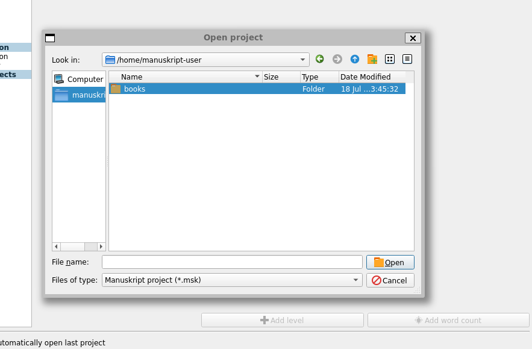

# Manuskript under Docker Desktop / WSL2

This is a proof of concept for running [Manuskript](https://github.com/olivierkes/manuskript) via docker desktop on Windows. 

It has been developed on Docker-Desktop, but the idea of effectively using x11 forwarding would also potentially work on WSL2 directly (WSL2 has a built in x11 server)- or on WSL using an external x11 server such as [xming](https://sourceforge.net/projects/xming/).

## Contents
This project consists of :

|File| Description|
|--|--|
|README.md|this document|
|Dockerfile|the instructions to build the docker image|
|docker-compose.yml|the instructions on how launch the image |
|books|a folder which is mounted into the manuskript container, and contains the books worked on.  This books folder contains a copy of the example books-of-acts as seen in the manuskript repository.|

## Instructions
This guide assumes that you are running a Windows based operating system, running WSL2, and Docker-Desktop.  

- Clone this repository onto your computer.
- From a WSL terminal, navigate to this repository on your computer.
- Run ```docker-compose up -d``` from this directory.
- Docker will build a manuskript image(if it doesn't already exist) and will launch manuskript.
- wsl2 should support x11 forwarding - 

### Just Running Docker
Instead of running ```docker-compose up``` - it is also possible to just run docker, passing in the appropriate environment settings : This docker command is equivalent.
```
docker run -it -v /tmp/.X11-unix:/tmp/.X11-unix -v ./books:/home/manuskript-user/books -v /mnt/wslg:/mnt/wslg -e DISPLAY=$DISPLAY -e WAYLAND_DISPLAY=$WAYLAND_DISPLAY  -e XDG_RUNTIME_DIR=$XDG_RUNTIME_DIR -e PULSE_SERVER=$PULSE_SERVER manuskriptdocker:latest 
```

## Limitations
The Manuskript instance only has access to the files in the container, and the mounted books folder.  Manuskript runs as a user called `manuskript-user`, and the books folder can be found mapped in that user's home folder. 


The use of x11 forwarding means that manuskript could just be installed directly onto WSL and still executed.  This is true - but equally the use of x11 forwarding means that it could potentially be installed on Docker running against Hyper-V back ends

## Known Issues
- Executing through a powershell terminal won't work, as there is no x11 server environment settings to pass through.